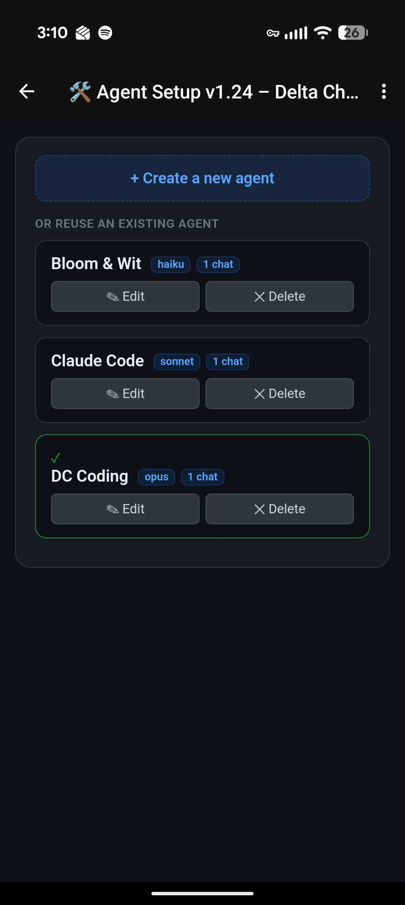
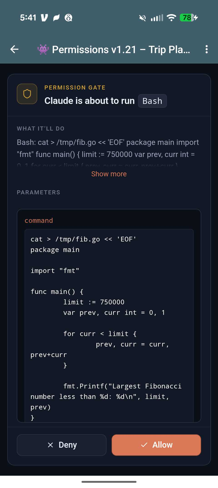
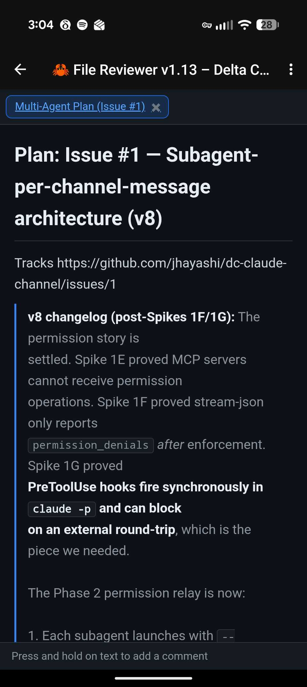

# Delta Chat Channel for Claude Code

D4C (Delta Chat Channel for Claude Code) is a Claude Code channel plugin that bridges [Delta Chat](https://delta.chat/) to Claude Code. You get an end-to-end encrypted chat interface to Claude from any phone or desktop with a Delta Chat client, backed entirely by your own machine or machines you control — no API keys, no bot portals, no fuss. Installation is two slash commands in Claude Code; pairing is a QR scan and a 5-letter code.

It gives you the full power of Claude Code in an open-source, privacy-forward, cross-platform chat app. Kick off a refactor on the train and tap and swipe through permission prompts on the way home. Ask Claude to summarize your inbox every morning at 8 and deliver the digest to a specific chat. On your morning walk, use your voice to vibe code. Because each chat is an independent agent with its own model, prompt, and tool access, a single Delta Chat account can hold a deep-reasoning coding agent, a news digester, a productivity agent for work, and agent helping you plan your next vacation.

Delta Chat's strong privacy and support for chat-native applications make it a great choice for developers. We've built on top of that foundation with a parallel subagent architecture, to offer integrated cron-like scheduling, private voice transcription, and easy-to-use chat-native GUIs that make configuration, coding, and productivity a great experience on the go.

## Feature Highlights

### For coding

- **End-to-end encryption** — all messages, files, voice recordings, and app data are automatically encrypted via [Autocrypt](https://autocrypt.org/). Your code never passes through a third-party server in readable form.
- **Parallel agent architecture** — each chat runs as an independent subagent process, so a long coding task in one chat never blocks a quick question in another. Claude stays responsive across all your conversations. Each chat also has an isolated context, so you aren't wasting tokens on irrelevant context. You can even reuse agent definitions across multiple chats.
- **Your chats have apps** — Delta Chat ships with a unique open-source app architecture called [WebXDC,](https://webxdc.org/) and Claude can easily build whatever you want using it — games, GUIs for your productivity tools, even multi-person app experiences - think a [real-time,](https://delta.chat/en/2024-11-20-webxdc-realtime) private fantasy sports like experience, but for anything! If that weren't cool enough, because your chat apps are connected to Claude, they can come alive with information and intelligence using Claude as a backend. We call this the "Familiar" WebXDC pattern (a skill and beta runtime is already included), and it's unique to Delta Chat and this channel plugin.
- **Fine-grained control: permissions, tools, MCP servers** — you decide the permission limits, access controls, and capabilities of every agent. Skipping permissions in channels is not longer an all or nothing dangerous choice, you decide where you want permissions and where you what to let Claude run free.
- **On-the-go file iteration** — D4C includes a built-in file reviewer that makes it easy to comment on specific parts of a markdown or source file and have Claude make the changes you need.
- **Session teleporting** — move your terminal sessions to Delta Chat and back again. Use the "settings" GUI to move a chat to a terminal session or pick a recent session from the settings GUI to continue it in a new DC chat. Take your active coding session with you on the bus, on your morning walk, or even to your fundraising pitch.

### For productivity

- **Scheduled actions** — D4C adds "claw" like scheduling to Claude Code. Get pre-scheduled summaries of your email, news, or pipeline reports when you want, in any chat, even if the agent has been put to sleep. Schedules require an always on computer that you control.
- **Multiple, customized agents** — D4C makes it easy to set up new chats with custom agents you control — one for marketing, one for research, one for email and calendar. Agents use the [Claude Managed Agents](https://docs.anthropic.com/en/docs/agents-and-tools/managed-agents) agent defintion and can be imported, exported, and shared with others.
- **GUIs when you need them** — D4C comes with three helper apps: one for permissions, one for file review (which also renders Marp slide decks inline), and one for agent and chat configuration.
- **Files, screenshots, and more** — Delta Chat makes it easy to send files, screenshots, links, and voice recordings to specific agents for whatever action you can imagine — archive in Notion or Obsidian, process and summarize URLs, you name it.

### For everybody

- **Easy to get started** — Despite all it does, D4C is the easiest Claude Code channel to set up. It even comes with an optional Getting Started Tour to familiarize you with its features and walk you through one-shotting your first WebXDC app.
- **Type with your voice, privately** — D4C includes built-in voice transcription that installs and uses a local model on your machine for high-quality, open-source, private transcription (Whisper).
- **Vibe code games with your kids** — need to distract the kids? Have them tell Claude what kind of game to make for infinite entertainment — using their voice!

> **Beyond the channels research preview:** The Claude Code channels API provides the messaging transport — this plugin builds substantially on top of it. Features like multi-agent with per-agent tool restrictions, cron-like scheduled jobs, interactive WebXDC permission cards (vs. text-based), the Familiar app runtime, local voice transcription, live activity emoji reactions, the file reviewer with inline commenting, and slide presentations are all implemented in this plugin and are not part of the base channels API. The official channels research preview provides message routing and basic tool proxying; everything above that is custom.

## Screenshots

<p align="center">
  
  &nbsp;&nbsp;
  
</p>
<p align="center">
  <em>Multiple agents, isoldated chats</em>
  &nbsp;&nbsp;&nbsp;&nbsp;&nbsp;&nbsp;&nbsp;&nbsp;
  <em>Agent setup in a WebXDC app</em>
</p>

<p align="center">
  
  &nbsp;&nbsp;
  
</p>
<p align="center">
  <em>Optional permissions GUI</em>
  &nbsp;&nbsp;&nbsp;&nbsp;&nbsp;&nbsp;&nbsp;&nbsp;&nbsp;&nbsp;&nbsp;&nbsp;&nbsp;&nbsp;
  <em>Review and comment on code from your phone</em>
</p>

## Prerequisites

- [Claude Code CLI](https://docs.anthropic.com/en/docs/claude-code) v2.1.80 or later
- [Bun](https://bun.sh/) (v1.1+) on your `$PATH`
- [Delta Chat](https://delta.chat/) on your phone (Android, iOS, or desktop) with a [chatmail](https://chatmail.at/) account

## Installation

### Install via marketplace (recommended)

In any Claude Code session:

```
/plugin marketplace add jhayashi/dc-claude-channel
/plugin install deltachat@dc-claude-channel
```

Then launch Claude Code with the research-preview channel flag:

```bash
claude --dangerously-load-development-channels plugin:deltachat@dc-claude-channel
```

> **Why the `--dangerously-load-development-channels` flag?** During the Claude Code channels research preview, third-party channel plugins must be either on the official Anthropic allowlist or loaded with this flag. We're working toward allowlist approval — see [issue #8](https://github.com/jhayashi/dc-claude-channel/issues/8) for status. Team and Enterprise admins can alternatively add this plugin to their org's `allowedChannelPlugins` in managed settings to skip the flag.

### Updating

```
/plugin marketplace update
```

Then restart your Claude Code session to pick up the new version.

### Development install

If you want to hack on the plugin itself, see the [Development](#development) section below.

## First-Time Setup

On first launch, the plugin auto-provisions a bot account on a chatmail server. On subsequent launches, it resumes the saved account.

### 1. Get the bot's invite link

In Claude Code, run:

```
/deltachat:configure invite
```

This prints a QR code link.

### 2. Add the bot in Delta Chat

Open the link in a browser on the same machine running the terminal. On the web page that loads, tap the **triangle icon** to reveal the QR code. Scan the QR code from your Delta Chat app to add Claude as a verified contact.

### 3. Pair your chat

Once you've added Claude as a contact, send any message. Claude will reply with a command to type into your terminal:

> Pairing required — run in Claude Code:
> /deltachat:access pair abcde

Type that command into your Claude Code terminal to establish the link between your Delta Chat account and Claude. This ensures no one else can command your Claude agent.

### 4. Tutorial

After pairing, the bot sends two WebXDC apps (Permission Prompt and File Reviewer) and offers a guided tour. The tutorial walks you through:

- **Permission prompts** — how to tap the centered message to Allow or Deny
- **File Reviewer** — syntax-highlighted code/doc viewer with inline commenting
- **App building** — optionally build a WebXDC app right in the chat

Reply "yes" to start, or "no" to skip. You can start using Claude immediately either way.

## Resuming sessions

A conversation can move between a DC chat and a local `claude` terminal session, because both sides use the same `.jsonl` session file. Tell Claude "resume this in my terminal" (or "teleport this to my terminal" — same thing) and the reply includes a one-line `cd … && claude --resume <uuid>` command. Wait for the reply to land, then paste it in a terminal — your full history (TodoWrites, plans, tool outputs) loads instantly.

Going the other direction: tell Claude "resume a terminal session here" (or open the agent-setup card and tap **Resume a conversation**). The card lists recent `claude` sessions from the last 5 days; pick one and the next message you send in the DC chat continues that session.

The session file is single-writer, so finish your DC turn before pasting the resume command — the lock releases when the reply lands. Don't send DC messages while the terminal session is still active, or the two sides will fight over the file. This is a same-machine feature; it doesn't involve claude.ai.

## Development

To hack on the plugin itself:

```bash
git clone https://github.com/jhayashi/dc-claude-channel.git
cd dc-claude-channel/plugin
bun install
bun test
```

Then add your local clone as a marketplace and install from it so your edits take effect in place:

```
/plugin marketplace add /absolute/path/to/dc-claude-channel
/plugin install deltachat@dc-claude-channel
```

Launch Claude Code with `--dangerously-load-development-channels plugin:deltachat@dc-claude-channel`. After each edit, run `/plugin marketplace update` and restart the session to pick up changes. See [CLAUDE.md](CLAUDE.md) for architecture notes and development gotchas.

## License

MIT — see [LICENSE](LICENSE).
