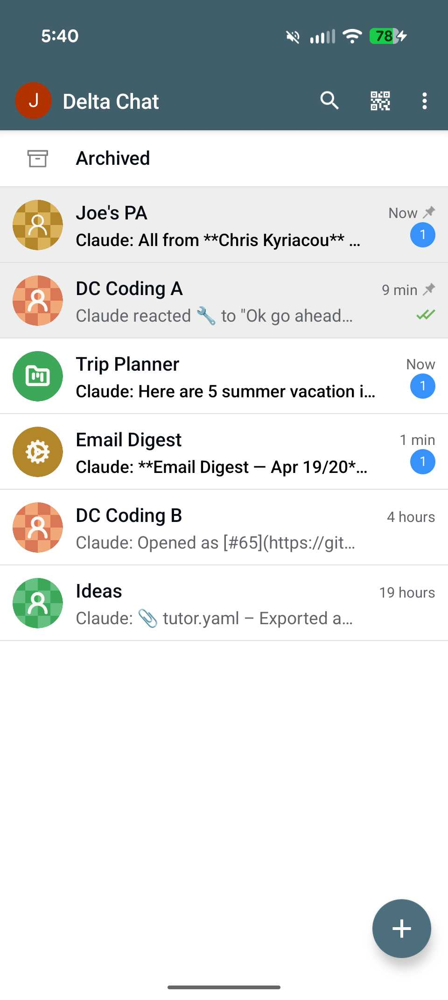
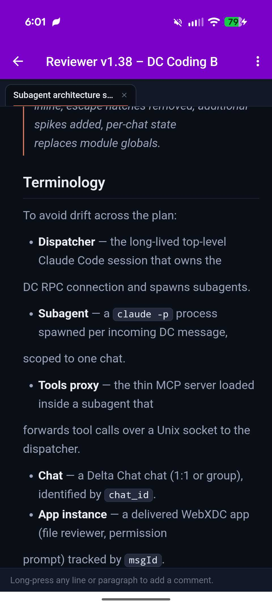
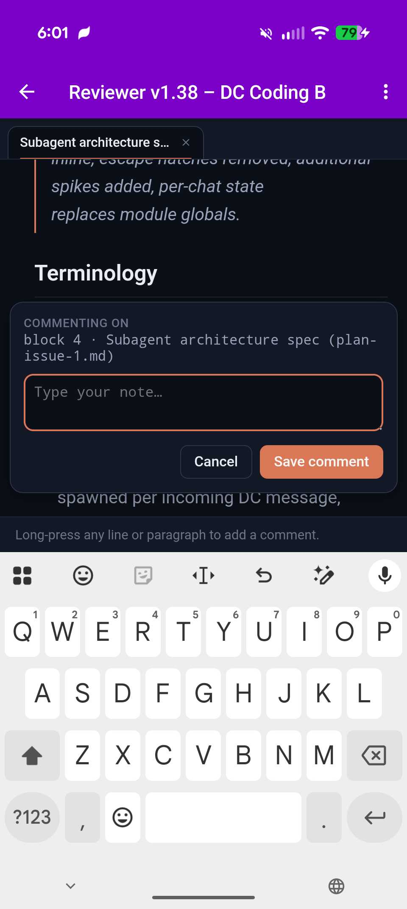
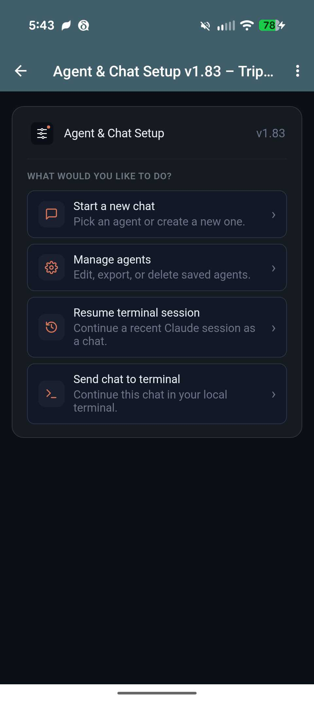
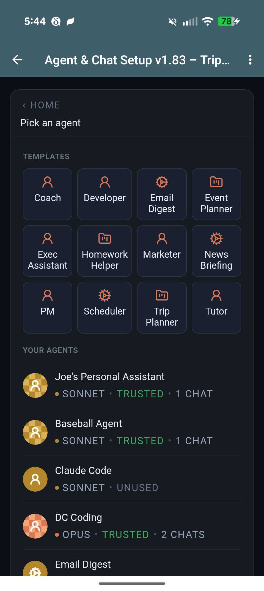
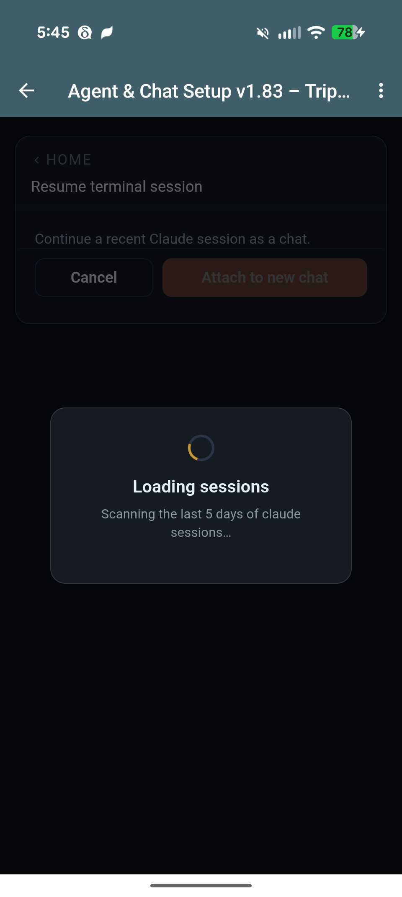
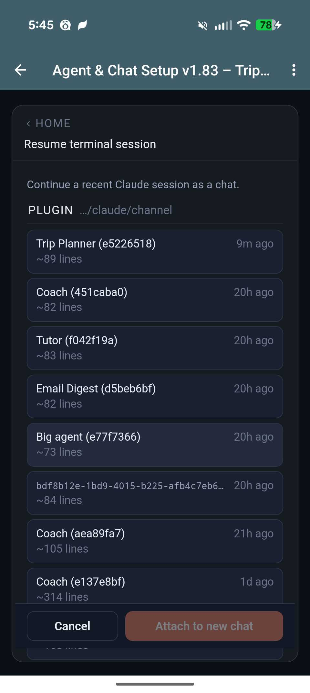

# Delta Chat Channel for Claude Code

D4C (Delta Chat Channel for Claude Code) is a Claude Code channel plugin that bridges [Delta Chat](https://delta.chat/) to Claude Code. You get an end-to-end encrypted chat interface to Claude from any phone or desktop with a Delta Chat client, backed entirely by your own machine or machines you control — no API keys, no bot portals, no fuss. Installation is two slash commands in Claude Code; pairing is a QR scan and a 5-letter code.

It gives you the full power of Claude Code in an open-source, privacy-forward, cross-platform chat app. Kick off a refactor on the train and tap and swipe through permission prompts on the way home. Ask Claude to summarize your inbox every morning at 8 and deliver the digest to a specific chat. On your morning walk, use your voice to vibe code. Because each chat is an independent agent with its own model, prompt, and tool access, a single Delta Chat account can hold a deep-reasoning coding agent, a news digester, a productivity agent for work, and an agent helping you plan your next vacation.

Delta Chat's strong privacy and support for chat-native applications make it a great choice for developers. We've built on top of that foundation with a parallel subagent architecture, to offer integrated cron-like scheduling, private voice transcription, and easy-to-use chat-native GUIs that make configuration, coding, and productivity a great experience on the go.

## Feature Highlights

### For coding

- **End-to-end encryption** — all messages, files, voice recordings, and app data are automatically encrypted via [Autocrypt](https://autocrypt.org/). Your code never passes through a third-party server in readable form.
- **Parallel agent architecture** — each chat runs as an independent subagent process, so a long coding task in one chat never blocks a quick question in another. Claude stays responsive across all your conversations. Each chat also has an isolated context, so you aren't wasting tokens on irrelevant context. You can even reuse agent definitions across multiple chats.
- **Your chats have apps** — Delta Chat ships with a unique open-source app architecture called [WebXDC](https://webxdc.org/), and Claude can easily build whatever you want using it — games, GUIs for your productivity tools, even multi-person app experiences — think a private, [real-time](https://delta.chat/en/2024-11-20-webxdc-realtime), fantasy-sports-like experience, but for anything! If that weren't cool enough, because your chat apps are connected to Claude, they can come alive with information and intelligence using Claude as a backend. We call this the "Familiar" WebXDC pattern (a skill and beta runtime are already included), and it's unique to Delta Chat and this channel plugin.
- **Fine-grained control: permissions, tools, MCP servers** — you decide the permission limits, access controls, and capabilities of every agent. Skipping permissions in channels is no longer a dangerous all-or-nothing choice; you decide where you want permissions and where you want to let Claude run free.
- **On-the-go file iteration** — D4C includes a built-in file reviewer that makes it easy to comment on specific parts of a markdown or source file and have Claude make the changes you need. In-document find jumps to any phrase across the rendered prose, and "Export file" hands the open doc back to the chat as a real DC attachment so you can open it in Obsidian, Marked, or any editor your phone has.
- **Session teleporting** — move your terminal sessions to Delta Chat and back again. Use the "settings" GUI to move a chat to a terminal session or pick a recent session from the settings GUI to continue it in a new DC chat. Take your active coding session with you on the bus, on your morning walk, or even to your fundraising pitch.
- **Slash commands** — familiar Claude Code slash commands work in DC chats: `/help`, `/model <tier>`, `/effort <level>`, `/think <prompt>`, `/ultrathink <prompt>`, `/plan <prompt>`, `/usage`, `/memory`, `/compact`, `/clear`, `/stop`, `/mcp`, `/plugin`. Per-agent overrides (model, effort) persist across messages.
- **Edit-a-message-to-interrupt** — long-press any message you sent and edit it. D4C stops the in-flight turn and dispatches the edited prompt as a fresh request, with the prior conversation still in context. Tapping `/stop` does the same thing without the rewrite.

### For productivity

- **Scheduled actions** — D4C adds cron-like scheduling to Claude Code. Get pre-scheduled summaries of your email, news, or pipeline reports when you want, in any chat, even if the agent has been put to sleep. Schedules require an always-on computer that you control.
- **Multiple, customized agents** — D4C makes it easy to set up new chats with custom agents you control — one for marketing, one for research, one for email and calendar. Build from a 155-leaf specialty catalog (sleep coach, tax prep, naturalist, knowledge worker, …), stack 1–3 leaves into a mash-up, and a coach interview shapes the agent in two or three short questions. Tweak any agent in chat ("let's refine you", "switch to opus", "trust me") — or pick a saved agent / the default and start chatting in two taps. Agents use the [Claude Managed Agents](https://docs.anthropic.com/en/docs/agents-and-tools/managed-agents) definition format and can be imported, exported, and shared with others.
- **GUIs when you need them** — D4C comes with three helper apps: one for permissions, one for file review (which also renders Marp slide decks inline), and one for agent and chat configuration.
- **Files, screenshots, and more** — Delta Chat makes it easy to send files, screenshots, links, and voice recordings to specific agents for whatever action you can imagine — archive in Notion or Obsidian, process and summarize URLs, you name it.

### For everybody

- **Easy to get started** — Despite all it does, D4C is the easiest Claude Code channel to set up. It even comes with an optional Getting Started Tour to familiarize you with its features and walk you through one-shotting your first WebXDC app.
- **Type with your voice, privately** — D4C includes built-in voice transcription that installs and uses a local model on your machine for high-quality, open-source, private transcription (Whisper).
- **Vibe code games with your kids** — need to distract the kids? Have them tell Claude what kind of game to make for infinite entertainment — using their voice!

> **Beyond the channels research preview:** The Claude Code channels API provides the messaging transport — this plugin builds substantially on top of it. Features like multi-agent support with per-agent tool restrictions, cron-like scheduled jobs, interactive WebXDC permission cards (vs. text-based), the Familiar app runtime, local voice transcription, live activity emoji reactions, the file reviewer with inline commenting, and slide presentations are all implemented in this plugin and are not part of the base channels API. The official channels research preview provides message routing and basic tool proxying; everything above that is custom.

## Screenshots

<table align="center">
<tr>
  <td align="center"><br><em>Multiple chats with separate context</em></td>
  <td align="center"><br><em>Optional permission GUI</em></td>
</tr>
<tr>
  <td align="center"><br><em>GUI iteration on files</em></td>
  <td align="center"><br><em>Long press to comment</em></td>
</tr>
<tr>
  <td align="center"><br><em>GUI chat &amp; agent setup</em></td>
  <td align="center"><br><em>Simple new chat creation</em></td>
</tr>
<tr>
  <td align="center"><br><em>Teleport recent sessions</em></td>
  <td align="center"><br><em>Easy to find recent sessions</em></td>
</tr>
</table>

## Prerequisites

- [Claude Code CLI](https://docs.anthropic.com/en/docs/claude-code) v2.1.80 or later
- [Bun](https://bun.sh/) (v1.1+) on your `$PATH`
- [Delta Chat](https://delta.chat/) on your phone with a [chatmail](https://chatmail.at/) account. Tested on **Android 2.49**, **iOS 2.48**, **macOS 2.49**, with **dc-core 2.49**. Older versions may work but are unsupported.

## Installation

### A. Channel installation

At the Claude Code prompt, run these commands one at a time:

```
/plugin marketplace add jhayashi/dc-claude-channel
```

```
/plugin install deltachat@dc-claude-channel
```

When prompted for install scope, pick **"install for you"** — the plugin's state (paired phone, agents, schedules) is user-global, so a project-level install gives you nothing extra.

*Later, when a new version is out, run `/plugin marketplace update` followed by `/plugin reload-plugins` to pull and activate it — no Claude Code restart required for updates.*

### B. Relaunch and install the mobile app

Quit Claude Code, then relaunch with the channels flag:

```bash
claude --dangerously-load-development-channels plugin:deltachat@dc-claude-channel
```

> **Why the `--dangerously-load-development-channels` flag?** During the Claude Code channels research preview, third-party channel plugins must be either on the official Anthropic allowlist or loaded with this flag. We're working toward allowlist approval — see [issue #8](https://github.com/jhayashi/dc-claude-channel/issues/8) for status. Team and Enterprise admins can alternatively add this plugin to their org's `allowedChannelPlugins` in managed settings to skip the flag.

The plugin installs its native dependencies in the background (~30–120s). Use that time to set up your phone:

1. **Install Delta Chat** — get the official build from **[delta.chat/download](https://delta.chat/en/download)** (links to Google Play, the App Store, F-Droid, and desktop downloads).
2. **Create a chatmail account** — in the Delta Chat onboarding, choose to create a **chatmail** account. No email address, password, or signup form. Pick a display name and you'll land on an empty chat list.

### C. Secure pairing

Back in Claude Code, run:

```
/deltachat:setup
```

Claude Code prints a `https://i.delta.chat/…` link. If the background install is still finishing, the command blocks silently until it's ready — just wait.

Open the link in any browser. The page shows a **play button (▶)** in the middle — tap it to reveal the QR code (it's hidden by default so it doesn't leak if your screen gets recorded).

In Delta Chat on your phone, open the QR scanner. It's either a **QR icon in the top toolbar** of the chat list, or under the **new-chat (+) menu** as **"Scan QR code"** (varies by platform and version). Point your phone at the QR on your computer screen.

After a second or two, a new chat called **`Claude`** appears at the top of your chat list. Open it — the first message has your a 5-letter pairing code (e.g. `abcde`).

Back in Claude Code, type:

```
/deltachat:setup pair abcde
```

Replace `abcde` with your actual code. Your Delta Chat account is securely paired with your claude account.

### D. Optional tour

In the default chat, claude will offer to take you through a short guided tour covering:

- **Permissions** — tap Allow or Deny for sensitive actions
- **File Reviewer** — mobile friendly syntax-highlighted code/doc viewer with inline commenting
- **Agents & Chat setup** — create new chats from templates or custom agents you define
- **WebXDC apps** — one-shot a custom mini-app (or single-player game) right in the chat

Reply "no" to skip the tour and drop into normal chat mode.

### Development install

If you want to hack on the plugin itself, see the [Development](#development) section below.

## Removing a contact's access

Open the agent settings app (ask Claude to "open settings", or tap the notification when it appears) → tap an agent's **Manage** card → **Contacts**. Pick a contact and assign the **No permissions** role. The bot will stop responding to their messages and redact their content from chat history. The DC chat itself stays intact; delete it via DC's normal chat menu if you also want it gone.

From a terminal, `/deltachat:setup unpair` lists paired contacts and `/deltachat:setup unpair <contact_id>` removes one (with optional `delete` mode to also remove the chats).

## Resuming / Teleporting sessions

A conversation can move between a DC chat and a local `claude` terminal session in either direction. Ask Claude to **"open settings"** from any DC chat and pick what you want from the settings app — send the current chat to a terminal, or attach a recent terminal session to a new DC chat.

## Development

To hack on the plugin itself:

```bash
git clone https://github.com/jhayashi/dc-claude-channel.git
cd dc-claude-channel/plugin
bun install
bun test
```

Then add your local clone as a marketplace and install from it so your edits take effect in place — run these one at a time:

```
/plugin marketplace add /absolute/path/to/dc-claude-channel
```

```
/plugin install deltachat@dc-claude-channel
```

Launch Claude Code with `--dangerously-load-development-channels plugin:deltachat@dc-claude-channel`. After each edit, run `/plugin marketplace update` and restart the session to pick up changes. See [CLAUDE.md](CLAUDE.md) for architecture notes and development gotchas.

## License

MIT — see [LICENSE](LICENSE).
